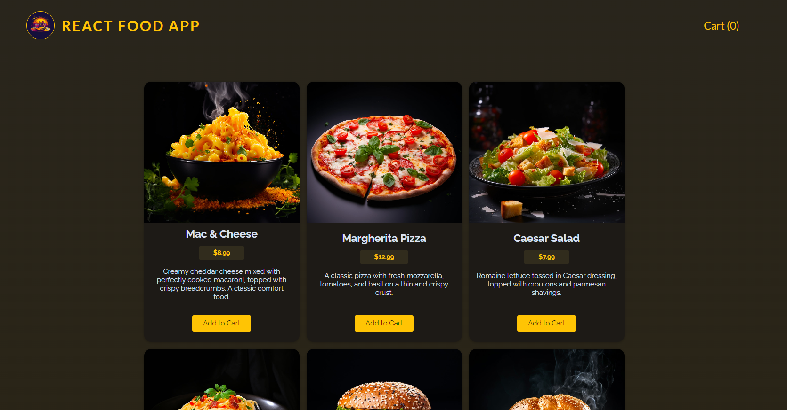

# ReactFoodApp

ReactFoodApp is a web application for browsing and ordering meals. It fetches meal data from a backend and allows users to add meals to their cart and submit orders.



## Features

- Fetch meal data from the backend
- Add meals to the cart
- Submit meals in the cart to the backend
- Utilizes `useState`, `useRef`, `useContext`, and custom React hooks

## Technologies Used

- React
- React Hooks (useState, useRef, useContext)
- Custom Hooks
- JavaScript
- CSS

## Getting Started

### Prerequisites

- Node.js
- npm or yarn

### Running the Application

1. Start the backend server (ensure it's running on the expected port):
   ```bash
   cd backend
   npm install
   npm start
   ```
2. Start the React application:
   ```bash
   npm install
   npm run dev
   ```

## Usage

- Browse the meals available.
- Add meals to your cart.
- Submit the order to the backend.

## Code Overview

### `src/hooks`

Contains custom hooks used in the project.

### `src/components`

Contains reusable components such as MealItem, Cart, etc.

### `src/store`

Contains useContext function to provide data to any components.
